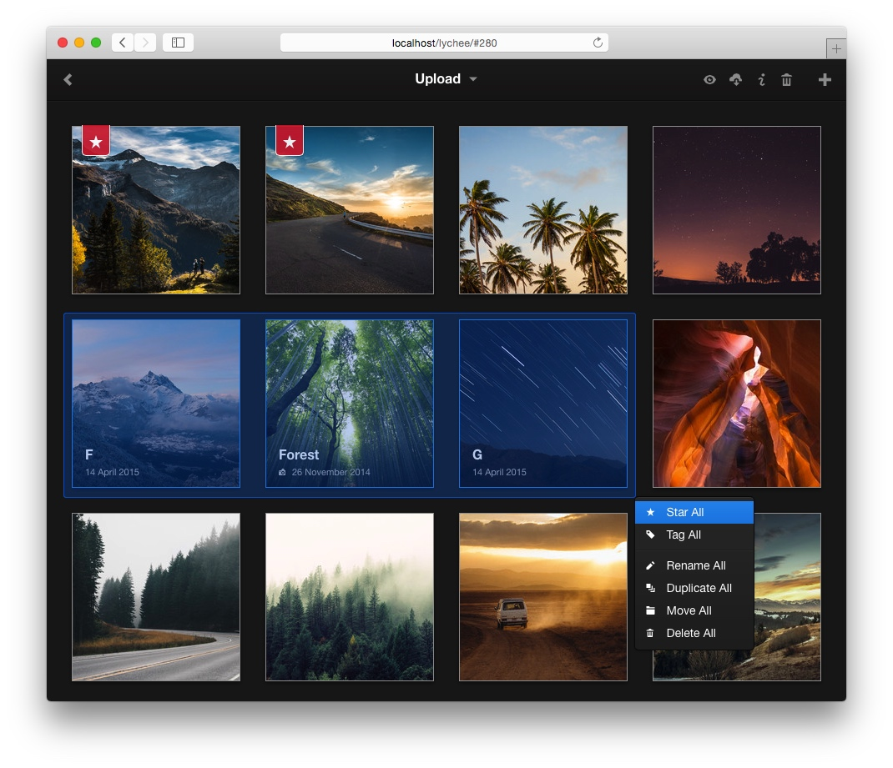

<!--
Ohart ongi: README hau automatikoki sortu da <https://github.com/YunoHost/apps/tree/master/tools/readme_generator>ri esker
EZ editatu eskuz.
-->

# Lychee YunoHost-erako

[](https://ci-apps.yunohost.org/ci/apps/lychee/)


[](https://install-app.yunohost.org/?app=lychee)

*[Irakurri README hau beste hizkuntzatan.](./ALL_README.md)*

> *Pakete honek Lychee YunoHost zerbitzari batean azkar eta zailtasunik gabe instalatzea ahalbidetzen dizu.*  
> *YunoHost ez baduzu, kontsultatu [gida](https://yunohost.org/install) nola instalatu ikasteko.*

## Aurreikuspena

Lychee is a free photo-management tool, which runs on your server or web-space.  
Upload, manage and share photos like from a native application.  
Lychee comes with everything you need and all your photos are stored securely.


**Paketatutako bertsioa:** 6.1.2~ynh2

**Demoa:** <https://lychee-demo.fly.dev/>

## Pantaila-argazkiak



## Dokumentazioa eta baliabideak

- Aplikazioaren webgune ofiziala: <https://lycheeorg.github.io/>
- Administratzaileen dokumentazio ofiziala: <https://lycheeorg.github.io/docs/>
- Jatorrizko aplikazioaren kode-gordailua: <https://github.com/LycheeOrg/Lychee>
- YunoHost Denda: <https://apps.yunohost.org/app/lychee>
- Eman errore baten berri: <https://github.com/YunoHost-Apps/lychee_ynh/issues>

## Garatzaileentzako informazioa

Bidali `pull request`a [`testing` abarrera](https://github.com/YunoHost-Apps/lychee_ynh/tree/testing).

`testing` abarra probatzeko, ondorengoa egin:

```bash
sudo yunohost app install https://github.com/YunoHost-Apps/lychee_ynh/tree/testing --debug
edo
sudo yunohost app upgrade lychee -u https://github.com/YunoHost-Apps/lychee_ynh/tree/testing --debug
```

**Informazio gehiago aplikazioaren paketatzeari buruz:** <https://yunohost.org/packaging_apps>
